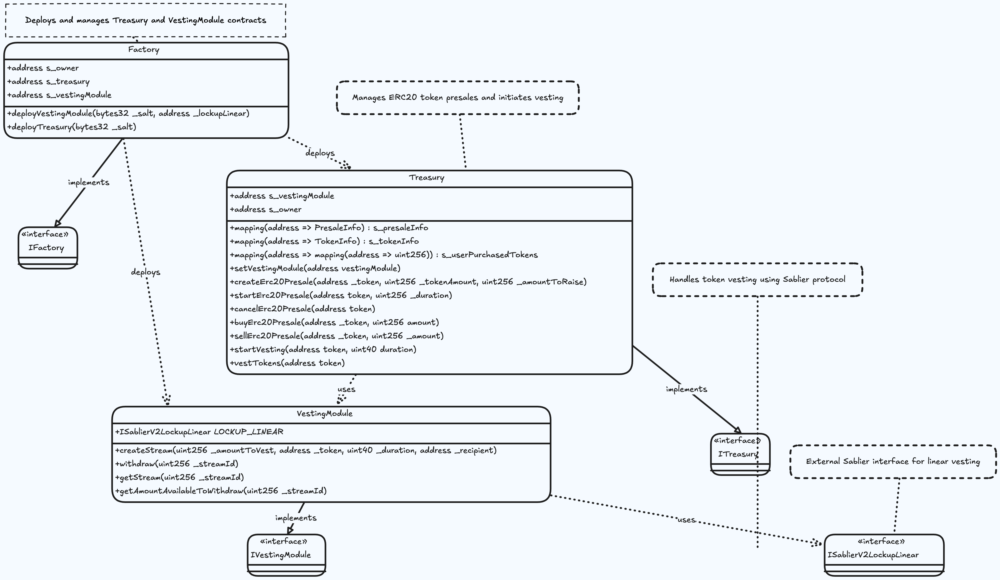

## ERC20 Presale Contract
A simple ERC20 presale smart contract using Sablier Linear Stream to distribute tokens over time.



### Build
Create an `.env` file and copy the variables from `.env.example`. Replace the rpc url with your rpc url.

```shell
$ git submodule update --init --recursive 
```

```shell
$ forge build
```

### Test

```shell
$ forge test
```

### Format

```shell
$ forge fmt
```


